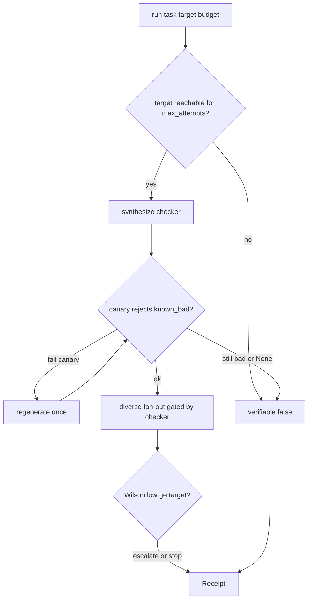

---
todos:
  - id: t0
    status: in_progress
    content: 'T0: Wilson unreachable guard + demo defaults (target=0.7, attempts=25) + target_met:true verify'
  - id: t1
    content: 'T1: Receipt.checker_validated/canary_detail + CLI canary beat (extend existing canary)'
    status: pending
  - id: t2
    content: 'T2: Anthropic defaults when key set; 5-task live smoke'
    status: pending
  - id: t3
    content: 'T3: rich.live dual-column progressive CLI'
    status: pending
  - id: t4
    content: 'T4: Harden, dead-code sweep, README/claims; stop at 14:35 for submission'
    status: pending
name: Hackathon demo sprint
overview: 'Ordered T0→T4 plan to make the live demo honest and projector-ready: reachable Wilson targets, visible canary fields, zero-wiring Anthropic defaults, rich progressive CLI, then harden—building on what already exists on main after PR #10/#11.'
isProject: false
---

# Hackathon Demo Sprint Implementation Plan

> **For agentic workers:** REQUIRED SUB-SKILL: Use superpowers:subagent-driven-development (recommended) or superpowers:executing-plans to implement this plan task-by-task. Steps use checkbox (`- [ ]`) syntax for tracking.

**Goal:** Make Nines stage-ready by 14:35 — reachable `target_met`, visible canary validation, zero-wiring live Claude, rich progressive CLI, hardened demo — without inventing roadmap features.

**Architecture:** Keep the single public seam [`nines.run`](nines/run.py). Extend `Receipt` for canary visibility; add a preflight Wilson reachability gate; default Anthropic ports only when `ANTHROPIC_API_KEY` is set and no ports injected; replace plain `demo.compare` printing with `rich.live` dual-column output.

**Tech Stack:** Python 3.11+, existing `anthropic` + `pytest` + `hypothesis`, add `rich`. No web UI.

**Plan file (on execute):** save/copy this plan to [`docs/plan/02.md`](docs/plan/02.md) (matches existing `docs/plan/01.md` convention).

## Global Constraints

- Public seam only: `nines.run(task, *, target, budget, **ports) -> Receipt`
- `target_met` iff Wilson lower bound ≥ `target` (z=1.96) — never widen interval / lower z / fake passes
- Verifier never sees solver reasoning — candidate output only
- One canary regenerate max, then honest `verifiable=False`
- Cut list: mixed-tier routing, cost projection, independence flag, web UI, hosted API, persistence, checker cache, multi-language
- Time boxes: if a task overruns >50%, stop, report incomplete, move on
- Hard stop build at 14:35 for submission text + rehearsal

## Already on main (do not rebuild)

| Capability | Where |
|---|---|
| Canary on fixed `__NINES_CANARY_BAD__` + 1 regenerate | [`nines/verifier/synthesize.py`](nines/verifier/synthesize.py), [`nines/verifier/canary.py`](nines/verifier/canary.py) |
| Degenerate-checker unit test | [`tests/test_verifier.py`](tests/test_verifier.py) |
| 429 backoff + semaphore(3) | [`nines/solver/call.py`](nines/solver/call.py) |
| Anthropic solver/synthesizer (demo-wired only) | [`nines/solver/anthropic_llm.py`](nines/solver/anthropic_llm.py), [`demo/compare.py`](demo/compare.py) |
| Scrubbed sandbox env | [`nines/sandbox.py`](nines/sandbox.py) |

## Math correction (T0)

With z=1.96, **5/5 Wilson low ≈ 0.565** — so `--trials 5 --target 0.6` can **never** print `target_met: true`. Do not weaken Wilson. Use:

- Verify beat: `--trials 6 --target 0.6` (6/6 low ≈ 0.610) **or** `--trials 5 --target 0.55`
- Demo defaults: `target=0.7`, `max_attempts=25` (9/9 perfect clears 0.7; 25/25 low ≈ 0.867)

## File structure (delta)

```
nines/
  types.py              # + checker_validated, canary_detail on Receipt
  run.py                # unreachable-target guard; Anthropic defaults; fill new fields
  stats/wilson.py       # + max_achievable_lower_bound(n)
  verifier/canary.py    # task-shaped known_bad helper (keep fixed sentinel as fallback)
  verifier/synthesize.py# wire known_bad; expose canary detail
demo/
  compare.py            # defaults; rich live UI; print canary beat
  rich_ui.py            # NEW: Live dual-column table
examples/
  live_smoke_tasks.py   # NEW: 5 unseen tasks for T2
tests/
  test_unreachable.py   # NEW
  test_verifier.py      # assert checker_validated
  test_defaults.py      # NEW: Anthropic default wiring with fakes/monkeypatch
  test_rich_compare.py  # NEW: smoke that UI path returns both receipts
pyproject.toml          # + rich
README.md / docs/claims.md
docs/plan/02.md         # this plan
```



---

### Task 0: Reachable targets + unreachable guard (T0)

**Files:**
- Modify: [`nines/stats/wilson.py`](nines/stats/wilson.py)
- Modify: [`nines/run.py`](nines/run.py)
- Modify: [`demo/compare.py`](demo/compare.py) (defaults only)
- Create: [`tests/test_unreachable.py`](tests/test_unreachable.py)
- Modify: [`README.md`](README.md) demo command defaults

**Interfaces:**
- Consumes: existing `wilson_interval`, `Budget.max_attempts`
- Produces: `max_achievable_lower_bound(max_attempts: int, z: float = 1.96) -> float` (= `wilson_interval(n, n)[0]` for finite n; `1.0` if unlimited); `run` early-return when `target > that bound`

- [ ] **Step 1: Write failing tests**

```python
# tests/test_unreachable.py
from nines import run, Task, Budget
from nines.stats.wilson import max_achievable_lower_bound
from tests.fakes import FakeSolver, FakeSynthesizer

def test_max_achievable_five_below_point_six():
    assert max_achievable_lower_bound(5) < 0.6

def test_unreachable_target_short_circuits_without_solver_calls():
    solver = FakeSolver(always_pass=True)
    receipt = run(
        Task(prompt="implement add(a,b)"),
        target=0.99,
        budget=Budget(max_cost_usd=10.0, max_attempts=5),
        synthesizer=FakeSynthesizer.ok_checker(),
        solver=solver,
    )
    assert receipt.target_met is False
    assert receipt.attempts == []
    assert solver.calls == 0
    assert "unreachable" in (receipt.detail or "").lower()

def test_reachable_target_can_meet():
    receipt = run(
        Task(prompt="implement add(a,b)"),
        target=0.55,
        budget=Budget(max_cost_usd=10.0, max_attempts=5),
        synthesizer=FakeSynthesizer.ok_checker(),
        solver=FakeSolver(always_pass=True),
        initial_batch=5,
        escalate=False,
    )
    assert receipt.target_met is True
    assert receipt.wilson_low is not None and receipt.wilson_low >= 0.55
```

- [ ] **Step 2: Run — expect FAIL**

Run: `pytest tests/test_unreachable.py -v`  
Expected: FAIL (`max_achievable_lower_bound` missing / no early return)

- [ ] **Step 3: Implement**

```python
# nines/stats/wilson.py
def max_achievable_lower_bound(max_attempts: int | None, z: float = 1.96) -> float:
    if max_attempts is None:
        return 1.0
    if max_attempts <= 0:
        return 0.0
    low, _ = wilson_interval(max_attempts, max_attempts, z=z)
    return low
```

In [`nines/run.py`](nines/run.py), after resolving `Budget`, before synthesis:

```python
cap = max_achievable_lower_bound(b.max_attempts)
if target > cap:
    return Receipt(..., verifiable=False, target_met=False, attempts=[],
        detail=f"unreachable: target {target} exceeds best Wilson lower bound {cap:.4f} for max_attempts={b.max_attempts}",
        checker_validated=False, canary_detail="skipped: unreachable target")
```

Note: set `checker_validated`/`canary_detail` once Task 1 adds those fields; until then use a temporary stub only if Task 0 lands first — **prefer implementing Task 1 Receipt fields in the same commit as Task 0** if types would otherwise break (see Task 1 Step 3 defaults).

Demo defaults in [`demo/compare.py`](demo/compare.py):

```python
parser.add_argument("--trials", type=int, default=25)
parser.add_argument("--target", type=float, default=0.7)
```

Nines path: set `escalate=True` by default in compare (or `ports.setdefault("escalate", True)`) so imperfect solvers can climb; keep `max_attempts=args.trials`.

- [ ] **Step 4: Pass tests + manual verify**

Run: `pytest tests/test_unreachable.py tests/test_wilson_escalate.py -v`  
Expected: PASS

Manual (mock path, no key needed):

```bash
python -m demo.compare --fallback --trials 6 --target 0.6
```

Expected: nines summary includes `target_met=True` when all attempts pass the fallback checker.

Time-box check for unreachable (no API):

```bash
time python -c "from nines import run,Task,Budget; r=run(Task('x'),target=0.99,budget=Budget(1.0,5)); print(r.detail)"
```

Expected: finishes &lt;2s, detail mentions unreachable, no network.

- [ ] **Step 5: Commit**

```bash
git add nines/stats/wilson.py nines/run.py demo/compare.py tests/test_unreachable.py README.md
git commit -m "feat: refuse unreachable Wilson targets; fix demo defaults"
```

---

### Task 1: Canary visibility on Receipt + CLI beat (T1)

**Files:**
- Modify: [`nines/types.py`](nines/types.py)
- Modify: [`nines/verifier/canary.py`](nines/verifier/canary.py)
- Modify: [`nines/verifier/synthesize.py`](nines/verifier/synthesize.py)
- Modify: [`nines/run.py`](nines/run.py) (populate fields on every return)
- Modify: [`demo/compare.py`](demo/compare.py) (print canary line)
- Modify: [`tests/test_verifier.py`](tests/test_verifier.py)
- Update all `Receipt(...)` constructions (run + compare baseline)

**Interfaces:**
- Consumes: existing canary gate
- Produces: `Receipt.checker_validated: bool`, `Receipt.canary_detail: str`; `known_bad_for_task(task: Task) -> str` (task-shaped wrong output; fallback to `__NINES_CANARY_BAD__`)

- [ ] **Step 1: Write failing tests**

```python
# extend tests/test_verifier.py
def test_degenerate_checker_fails_canary_and_short_circuits():
    ...
    assert receipt.verifiable is False
    assert receipt.checker_validated is False
    assert "canary" in (receipt.canary_detail or "").lower()
    assert receipt.attempts == []

def test_ok_checker_sets_checker_validated_true():
    receipt = run(
        Task(prompt="implement add(a,b)"),
        target=0.55,
        budget=Budget(max_cost_usd=1.0, max_attempts=5),
        synthesizer=FakeSynthesizer.ok_checker(),
        solver=FakeSolver(always_pass=True),
        initial_batch=5,
        escalate=False,
    )
    assert receipt.checker_validated is True
    assert receipt.canary_detail
```

- [ ] **Step 2: Run — expect FAIL** (`checker_validated` missing)

- [ ] **Step 3: Implement**

Add to `Receipt`:

```python
checker_validated: bool = False
canary_detail: str | None = None
```

`known_bad_for_task`: return a wrong artifact string biased by prompt keywords (e.g. empty / `"not-a-number"` / `"__NINES_CANARY_BAD__"`). Keep independence: never call a solver for canary.

Wire `synthesize_verifier` to use that known_bad; return detail strings like `"canary rejected known_bad"` / `"canary failed: checker accepted known_bad after retry"`.

Every `Receipt` construction sets both fields (unverifiable + success paths).

CLI after synthesis / before attempts:

```text
[canary] validated=True detail=rejected known_bad '__NINES_CANARY_BAD__'
```

- [ ] **Step 4: Pass**

Run: `pytest tests/test_verifier.py tests/test_unreachable.py tests/test_run_seam.py -v`

- [ ] **Step 5: Commit**

```bash
git commit -m "feat: expose canary validation on Receipt and CLI"
```

**Do not:** regenerate more than once.

---

### Task 2: Zero-wiring Anthropic defaults + 5-task smoke (T2)

**Files:**
- Modify: [`nines/run.py`](nines/run.py) — default ports when key set
- Create: [`examples/live_smoke_tasks.py`](examples/live_smoke_tasks.py)
- Create: [`tests/test_defaults.py`](tests/test_defaults.py)
- Modify: [`README.md`](README.md) — document bare `run` + key

**Interfaces:**
- Consumes: `AnthropicSolver`, `AnthropicSynthesizer`
- Produces: if `synthesizer`/`solver`/`llm` all absent and `ANTHROPIC_API_KEY` in env → inject Anthropic defaults; injected ports always win

- [ ] **Step 1: Failing test (no live spend)**

```python
# tests/test_defaults.py
import os
from nines import run, Task, Budget

def test_defaults_use_anthropic_when_key_set(monkeypatch):
    monkeypatch.setenv("ANTHROPIC_API_KEY", "sk-test")
    called = {"synth": 0, "solve": 0}

    class S:
        def __call__(self, task, **kw):
            called["synth"] += 1
            from tests.fakes import FakeSynthesizer
            return FakeSynthesizer.ok_checker()(task)

    class V:
        def __call__(self, task, config, **kw):
            called["solve"] += 1
            return "PASS", 0.01

    monkeypatch.setattr("nines.solver.anthropic_llm.AnthropicSynthesizer", lambda: S())
    monkeypatch.setattr("nines.solver.anthropic_llm.AnthropicSolver", lambda: V())
    r = run(Task(prompt="implement add"), target=0.55,
            budget=Budget(max_cost_usd=1.0, max_attempts=5),
            initial_batch=5, escalate=False)
    assert called["synth"] >= 1 and called["solve"] >= 1
    assert r.verifiable is True

def test_injected_ports_still_override(monkeypatch):
    monkeypatch.setenv("ANTHROPIC_API_KEY", "sk-test")
    from tests.fakes import FakeSynthesizer, FakeSolver
    r = run(Task("poem"), target=0.9, budget=Budget(1.0),
            synthesizer=FakeSynthesizer(result=None), solver=FakeSolver())
    assert r.verifiable is False and r.attempts == []
```

- [ ] **Step 2: Implement defaults in `run`**

```python
if synthesizer is None and solver is None and llm is None and os.environ.get("ANTHROPIC_API_KEY"):
    from nines.solver.anthropic_llm import AnthropicSolver, AnthropicSynthesizer
    synthesizer = AnthropicSynthesizer()
    solver = AnthropicSolver()
```

- [ ] **Step 3: Live smoke (required if key present)**

```bash
python -c "from nines import run,Task,Budget; print(run(Task(prompt='Write a Python function reverse_string(s) that returns s reversed. Code only.'), target=0.7, budget=Budget(max_cost_usd=2.0, max_attempts=25)).target_met)"
```

Plus [`examples/live_smoke_tasks.py`](examples/live_smoke_tasks.py) with 5 tasks: string reverse, algorithm w/ edge cases, dict/list reshape, sorted invariant, subjective poem. Log a JSONL of `{task, verifiable, target_met, detail}` to stdout. Acceptance: ≥4/5 verifiable; poem `verifiable=False` and `attempts==[]`.

If a common-case break (fence stripping, synthesis prompt): fix in synthesize/sandbox/fallback only. Log unrepaired failures in README “Known limits”.

- [ ] **Step 4: Commit**

```bash
git commit -m "feat: default Anthropic ports when API key set"
```

**Time box:** 40 min + 50% = 60 min hard stop → move to T3 with smoke log of what failed.

---

### Task 3: Rich progressive dual-column CLI (T3)

**Files:**
- Modify: [`pyproject.toml`](pyproject.toml) — add `rich`
- Create: [`demo/rich_ui.py`](demo/rich_ui.py)
- Modify: [`demo/compare.py`](demo/compare.py) — use Live table via `on_attempt`
- Create: [`tests/test_rich_compare.py`](tests/test_rich_compare.py) — fakes, assert compare still returns both paths (UI construction smoke)

**Interfaces:**
- Consumes: `compare(..., on_attempt=...)`
- Produces: `DemoLive` with `rich.live.Live` + two-column table; final `Panel` with `target_met`, `best_output`, attempts, cost, `checker_validated`

- [ ] **Step 1: Add dependency + failing smoke**

```toml
dependencies = ["anthropic", "hypothesis", "httpx", "rich"]
```

```python
def test_compare_with_rich_callback_smoke():
    from demo.rich_ui import DemoLive
    live = DemoLive(target=0.7)
    # drive a few fake attempts then finalize
    ...
```

- [ ] **Step 2: Implement `DemoLive`**

Per attempt row update: path, pass/fail glyph, running passes/trials, Wilson `[low, high]`, cumulative cost. Prefer a fixed-height layout (table + status) so a 25-attempt run does not scroll the summary off-screen — update cells in place via `Live`.

Final panel fields required by acceptance.

- [ ] **Step 3: Wire `demo.compare` main to DemoLive; keep JSON dump after panel**

- [ ] **Step 4: Manual readability check at large font; commit**

```bash
git commit -m "feat: rich live single-shot vs nines demo UI"
```

---

### Task 4: Harden + submission honesty (T4)

**Files:**
- Verify: [`nines/solver/call.py`](nines/solver/call.py) backoff (already present — add/adjust test only if gap)
- Modify: [`README.md`](README.md), [`docs/claims.md`](docs/claims.md)
- Grep cleanup across `nines/`, `demo/`
- Optional: `demo.compare --reset` no-op banner (“no durable state; re-run is reset”)

- [ ] **Step 1: Confirm 429 test still green** — `pytest tests/test_harden.py -v`

- [ ] **Step 2: `--fallback` with key unset**

```bash
env -u ANTHROPIC_API_KEY python -m demo.compare --fallback --trials 6 --target 0.55
```

Expected: labeled mock path, completes, canary line visible.

- [ ] **Step 3: Dead-code sweep**

```bash
rg -n "TODO|FIXME|pass  #|stub: not implemented" nines demo examples
```

Delete or replace stubs that look like features. Label mocks as mocks in README.

- [ ] **Step 4: Full suite + claims pass**

```bash
pytest -v
```

Commit: `chore: harden demo and align submission claims`

- [ ] **Step 5: 14:35 stop** — submission text only claims: orchestration, verifier synthesis with canary, budgeted fan-out, Wilson-bounded measurement. Rehearse 90s ×2 + cost objection.

---

## Self-review

1. **Spec coverage:** T0→Task0, T1→Task1 (extends existing canary), T2→Task2, T3→Task3, T4→Task4. Cut list excluded.
2. **Placeholders:** none intentional.
3. **Type consistency:** `Receipt.checker_validated` / `canary_detail` used from Task 0 onward; Anthropic defaults only when ports absent; Wilson z stays 1.96.
4. **Known correction:** T0’s `--trials 5 --target 0.6` replaced with mathematically reachable commands.

## Execution handoff

Plan complete. Two execution options:

1. **Subagent-Driven (recommended)** — fresh subagent per task, review between tasks
2. **Inline Execution** — execute in this session with executing-plans checkpoints

Which approach?
